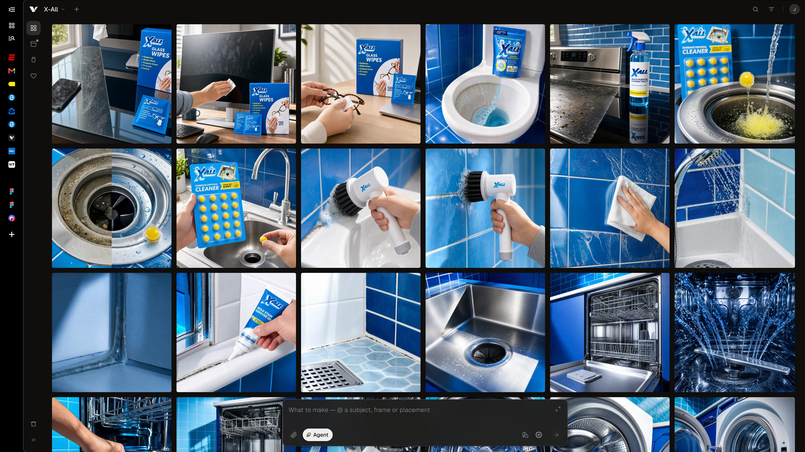
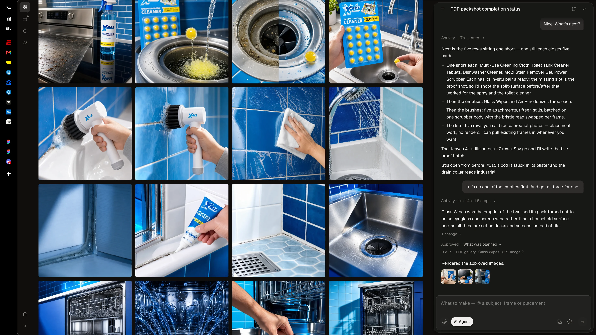
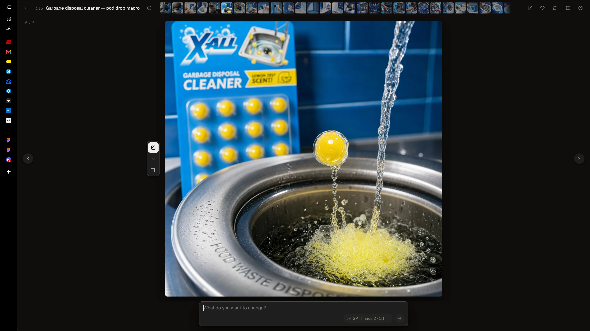

# I wanted a better Google Flow

> Unpublished working draft, September 10, 2026. The editorial notes at the end are not part of the article.

When I started using the agent inside Google Flow, it helped me make a real jump in the quality of my site assets. But it was hit or miss, and most often it was miss. I'd ask it to fix an image and sometimes it would just ignore the edit.

I still liked a lot about Flow. The grid, the minimal interface, having the agent right there with the images. I could bring in references and give it guidance, or turn the agent off and generate something directly.

So I started building Vellum around the parts I wanted to keep. I'm using it to make assets for [X-All](https://x-all.com/), a Shopify site I just finished rebuilding at work.

## Working on X-All

In one session, I asked the agent, "Nice. What's next?"

It listed the products that still needed images and suggested a batch. I asked it to do one of the products with empty slots first, and get all three images for that product.

It picked Glass Wipes. The agent said the pack described wipes for eyeglasses and screens, so it made the three images around desks and screens. Most of the surrounding board was blue tile, sinks, and cleaning products. These needed a different setting.

That's the kind of help I want from an embedded agent. It can look at what's already there and help me work out what to make next.

I've also added Subjects and Placements to organize the work. Subjects keep a product's notes and reference images together. Placements record the images needed for a particular use, so I can assign frames to a product gallery and export that set. References and style guides are available to the agent as it works.

There are still images to fix. In that same conversation, the agent flagged a garbage-disposal shot where the pod was stuck in its blister and the drain collar looked industrial. Both problems are still visible in the image.

## I still want to generate directly

At one point during the build, Vellum lost direct generation. That made it less useful to me than Flow. I couldn't just write a prompt and get an image.

I brought it back, and Generate is now the default. I can choose a model, attach images, and submit the prompt myself. When I want help from the agent, I can switch modes without losing what I've already typed or attached.

## Letting other agents use the images

I'm still working through the X-All assets. Once those are finished, I'll probably add a way for external agents to query Vellum through an API. An agent working on the site could then find the images I've already made and the placements they're meant for directly in Vellum.

---

## Editorial notes for the next revision

Keep this file as the single working draft until it is ready for the published `content/projects/` collection. No article date, performance claim, or public availability claim has been assigned.

Local preview: `/preview/vellum`. The development homepage includes its cobalt contact-sheet cover; production omits the draft and returns 404 for its preview and screenshot routes. The article preview reads this file and excludes these editorial notes.

- Add one completed X-All example with the original references, a few consequential iterations, and the final asset in its actual page placement. Identify which work came from Vellum; do not attribute every image on X-All to it.
- Add a specific Flow failure alongside its input and output if it helps explain a Vellum decision. The opening's ignored-edit example comes from Jackson's published Flow/Codex account; it does not establish the technical cause.
- Ask Jackson what Vellum improved in practice and what remains frustrating. The current draft describes motivation and functionality, not demonstrated quality, time, cost, or consistency gains.
- The supplied grid, agent conversation, and image-viewer screenshots are placed in the draft. Capture Subjects and Placements when they contain useful work to show. Keep unfinished visual placeholders out of the article.
- All four screenshots have 3840 × 2160 WebP copies in `assets/vellum/2026-09-10/`; the second grid capture is retained as an alternate. Original PNGs are preserved locally under ignored `output/vellum-sources/2026-09-10/` and in the supplied Desktop files. Consider app-only framing when preparing the article for publication.
- Update external-agent access only when its actual scope is known. The proposed agent interface is not described as shipped; Vellum already has an internal application API.

### Source basis

Jackson's account in the Channel47 task on September 10, 2026 supplies the origin, Flow experience, design preferences, X-All status, and proposed external-agent access. His published `content/notes/codex-static-ads-google-flow.md` supplies the account of Flow sometimes ignoring requested edits. The **Restore direct render flow** task supplies the decision to bring direct generation back. Vellum's current README, under **From generation to delivery**, and `packages/shared/src/schema.ts` support the descriptions of modes, subjects, and placements.

Jackson's September 10 screenshots supply the visible X-All board and the Glass Wipes exchange. Statements from the embedded agent are attributed to that conversation; its product interpretation, completion counts, and proposed before/after imagery are not independent evidence of product performance. No completed Shopify placement or original input reference is supplied by these screenshots.

The article deliberately makes no categorical claim that Flow has no API. On September 10, 2026, a search of Google's public documentation found its [embedded agent](https://support.google.com/flow/answer/17093911) and [project and asset controls](https://support.google.com/flow/answer/16935308?hl=en), but no documented public API or MCP interface for external agents to query that workspace. Google's [generation API](https://ai.google.dev/gemini-api/docs/veo) is a separate capability. Recheck before making a comparison in the published piece.
