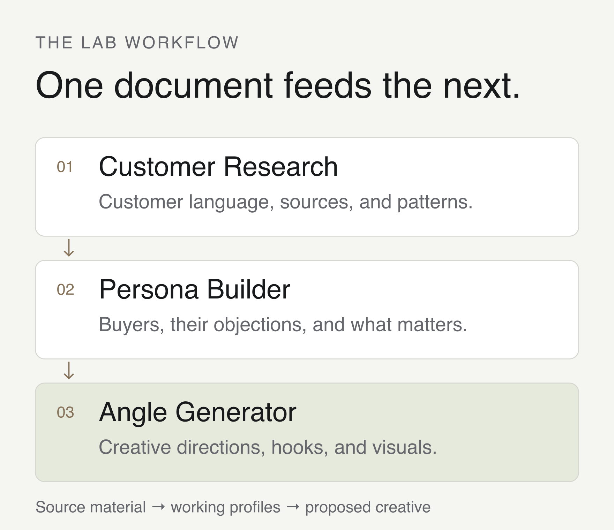
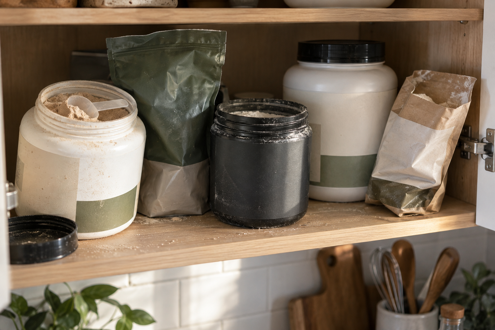
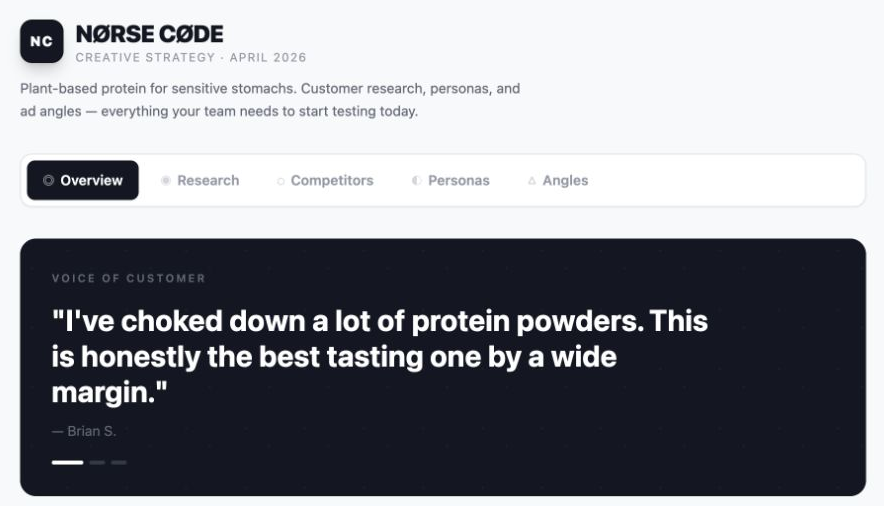

# Building a creative research pipeline

A cupboard full of half-used protein powder is a pretty good place to start an ad.

Each tub represents something somebody bought with the intention of using it. They tried it, stopped, and bought another one. Eventually the cupboard becomes a small collection of things that were supposed to work.

That was the premise behind “The Protein Graveyard,” one of the concepts produced by a creative research pipeline I built and demonstrated during a [mentor session in the Vibe Marketer community](https://thevibemarketer.beehiiv.com/p/your-d2c-ads-are-not-converting-the-problem-isn-t-your-offer-or-creative). For NØRSE CØDE, a plant-based protein brand, the work ran from customer research through buyer profiles to creative directions.

The proposed scene was simple: open the door, show the abandoned tubs, and let the viewer recognize the situation before explaining the product.

I wanted a process that could get from what people were saying to that kind of creative direction.

## Three skills, with a reason for each

I split the work into three skills for Claude: Customer Research, Persona Builder, and Angle Generator. A skill is a set of instructions the agent can reuse. In this case, each one produced a document that the next one read.

Customer Research gathered source material and organized what people were struggling with, what they had already tried, and the language they used. Persona Builder used that material to describe different kinds of buyers. Angle Generator took both documents and proposed ways to reach those people.



*The three stages used in the lab. Each stage carries the previous work forward.*

Keeping the documents separate made the thinking easier to inspect. If an angle seemed promising, I could look at the buyer it was written for and the research underneath it. If it seemed strange, there was somewhere to go back and look.

The source labels mattered here. A testimonial on a brand’s website, a search-result excerpt, and an article about a competitor give you different kinds of information. Collecting them in one file doesn’t make them equivalent. I wanted those distinctions to survive as the work moved along.

## The detail worth keeping

In the NØRSE CØDE research, a customer described having “choked down” protein powders over the years.

That phrase carries more than a preference about flavor. There’s effort in it. Someone keeps buying something they believe they should use, then has to talk themselves into using it.

The persona document separated a buyer worn out by previous bad experiences from one who scrutinizes ingredient labels before purchasing. It called them the Bloat Veteran and the Label Detective. They were working profiles assembled from the research, with different reasons to hesitate and different things they would want to see.

For the first person, another promise of great taste has a history to contend with. They’ve bought the promise before. For the second, showing the ingredient list might be the most useful place to begin.

That distinction gave the creative work somewhere to go. The angle document proposed six directions, including a label comparison and a daily-habit story. “The Protein Graveyard” took the history of disappointing purchases and gave it a physical form.



*A new AI-generated illustration of the cupboard concept, made for this article. The lab output was a written creative direction.*

I like how much of the story the objects can carry. You don’t need a paragraph explaining that someone has tried several products. You can see the accumulation. A half-used tub is a more interesting prop than a pristine one when the subject is giving up on something you bought.

There’s still a creative leap involved. A customer saying they struggled with protein powders doesn’t establish what is in their cupboard. The research gives the idea a reason to exist; the cupboard is how we might express it.

I can change the setting or throw out a headline while keeping that original observation available.

## Making the work easy to use

The lab files also include a small dashboard with tabs for research, competitors, personas, and angles.



*The original lab dashboard, rendered for this article from the saved April code.*

It puts the work within reach. You can move from a profile to an angle, open the proposed hooks, and look at the visual direction. Those are the things you need in front of you when deciding what to make.

This is a part of working with agents that interests me: giving the output a form that helps the next person use it. Research can be thorough and still be awkward to work from. A small interface can make it much easier to discuss a specific idea.

The following month, the work for ELT, an electrolyte brand, continued through research, personas, and angles. The preparation for that session went a step further, toward making a conversion page from the work. It included questions for the owner: which kind of customer actually buys and reorders, which angle feels right, and where the page should send someone who wants to purchase.

Those questions belong in the process. The documents provide something specific to discuss, and the person who knows the business can bring in what the research is missing.

A cupboard of abandoned protein powder is a useful beginning. I want to be able to follow an idea like that back to the observation behind it, put it in front of someone who knows the product, and then make something worth testing.

## Try it with your own brand

I've put together a starter kit with the workflow instructions, a blank brand brief, and a starting prompt. It gives you a way to work through the same three stages with your own product.

<p class="workflow-downloads"><a class="workflow-download" href="/downloads/creative-research-starter-v1.zip" download>Download the starter kit</a><a href="/downloads/creative-research-starter/SKILL.md">Read the workflow</a><a href="/downloads/creative-research-starter/brief.md" download>Download the blank brief</a></p>

Unzip the folder, fill in what you know in the brief, and attach it alongside the workflow instructions to your agent. Use browsing to gather public sources, or supply your own research. The kit includes newly written instructions you can reuse; the examples above stay with the article.

For a quick first pass, replace the bracketed details and copy this prompt. It also works on its own:

```text
Research why people buy [PRODUCT URL] in [MARKET]. Keep source links and separate evidence from assumptions.

Identify the main buyer types, then propose three ad ideas grounded in the research, with a hook and visual for each. Recommend one to develop first and flag anything that needs checking.
```

Bring the research and ideas to someone who knows the product: which buyer do they recognize, what have you misunderstood, and what could you actually show?
